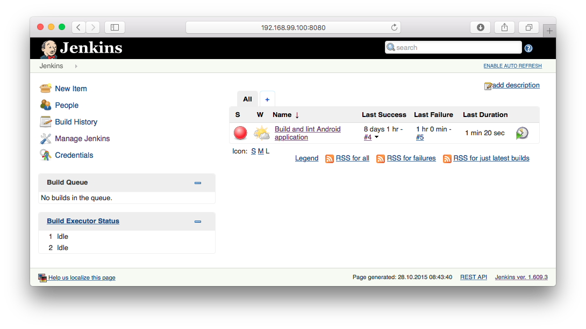

# docker-jenkins-android-lint
A preconfigured Jenkins instance to showcase the usage of *Android Lint* in *Continuous Integration* environments.



##Tools
- Docker
- Jenkins
- Android
- Gradle
- Git
- Lint

##Jenkins Plugins
- analysis-core:1.61
- android-lint:2.2
- gradle:1.24
- greenballs:1.14
- git-client:1.18.0
- scm-api:0.2
- git:2.4.0

##Install and build
```shell
$ git clone https://github.com/a11n/docker-jenkins-android-lint.git
$ cd docker-jenkins-android-lint
$ ./build.sh
```
##Run
```shell
$ ./start.sh
```
Open `http://<IP OF DOCKER MACHINE>:8080/` in your browser.

On OS X you can obtain the IP of your running docker-machine by running:
```shell
$ docker-machine ls
$ docker-machine ip <MACHINE>
```

##Requirements
Make sure to have Docker [installed and configured](https://docs.docker.com/mac/started/) on your system.
